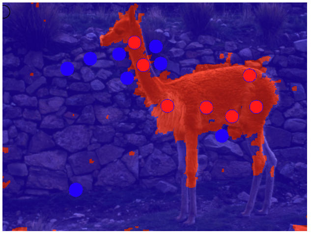

# GraphCut Computer Vision

Implemented interactive graph cut algorithm, which was developed by Professor Yuri Boykov. The general idea is that we want to perform object segmentation. In our case, we want to approximate two continuous hypersurface on the image so that we could separate the object from the image.

The algorithm we are using is Graph Cut algorithm. 

In the algorithm, we have source (s) and sink(t) and a set of non-terminal nodes P. We want to find the minimum cut from the source s to sink t. The cost of a cut C={S,T} is defined summing up the costs/weights of "boundary edges" (p,q) such that p is in S, and q is in T. The below picture is a nice demonstration of graph cut algorithm taken from Professor Boykov's and Professor Veksler's paper. https://cs.uwaterloo.ca/~yboykov/Papers/chapter_04.pdf

In the algorithms, we have t-links(links between non-terminal node and terminal node) and n-links (links between non-terminal nodes).

T-links describe individual likelihoods for segment labels (s and t). For the weights of t-links, we set it to be w_ps = D_p(t) = -ln Pr(I_p|theta_1) and w_ps = D_p(t) = -ln Pr(I_p|theta_0), representing the penalties/costs (negative log-likelihoods) for assigning label s or t to pixel p.

N-links enforce structured segmentation incorporating pixels dependencies/correlations. In this case, we only consider the pixels p, q such that their corresponding pixel beliefs are different (for example, we belive p is from background, and q is from object). Then, we add a corresponding weight to it, where weight of edge pq is defined as w_pq = lambda * exp{- || Ip - Iq||^2 / (2 * sigma^2)}.

Hence, we can define the objective function to be the sum of weights of N-links and t-links defined above.

In our case, we used interactive seed implementation to assist us in developing GMM to calculate the corresponding weights. When performing the optimization, we convert the minimum-cut problem into maximum flow problem. 

The below is the demonstration of the implementation results:

Original Joker picture vs Resulting Joker picture with sigma = 0.05, lambda = 20:

  
  

Original Spiderman(Tobey Maguire Version) picture vs Resulting Spiderman picture with sigma = 0.05, lambda = 100:

  
  

Original lama Picture vs Resulting lamma picture with sigma = 100, lambda = 5*10^8:

  
  

